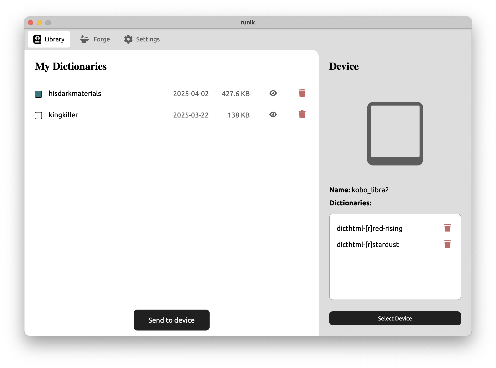

# Runik

<div style="text-align: center;">
  
</div>

Generate and manage custom e-reader dictionaries for your favourite fictional worlds.

## Motivation

Most e-readers have built-in dictionaries, letting you define words in-text as you read. While this feature can tell you the meaning of words like 'tabard' and 'thaumaturgy', it can't help you define names, places, or magical items specific to the world of your book. 

Runik leverages the crowd-sourced info of fan wikis to generate custom e-reader dictionaries, extending the volcabulary of your e-reader to include fictional references. 

## Installation

Binaries for Linux, macOS, and Windows can be found on the [releases page](https://github.com/Runik-3/core/releases).

## For developers

### Quick start

1. Clone the project
2. Run the app in dev mode
    ```
    wails dev
    ```
3. Build for your target OS
    ```
    wails build
    ```

Note: To build a flatpak for linux use the `make build-linux` command

### Dependencies

You'll need the following software installed on your system before being able to build and run runik.

- Wails CLI (install the version specified in go.mod)
- Go
- Nodejs + npm
- A C compiler


## Limitations

Runik is in early development and is bound to contain bugs. Feel free to report any [issues](https://github.com/Runik-3/core/issues) you encounter. 

Runik is designed to work with [MediaWiki](https://www.mediawiki.org/wiki/MediaWiki) sites. There is variablility in the way wikis can be configured or the way articles are written -- runik is not guaranteed to work with all of them. I mostly tested against Fandom wikis which are pretty consistent and *should* be well supported.

If Runik does not yet support your device -- and you are comfortable tinkering -- you can use the [Runik Builder](https://github.com/Runik-3/builder) cli tool to generate dictionaries and use one of the many other tools out there to convert it for use with your device.

## FAQs

>Why are Kobo dictionaries prefixed with dicthtml-[r]?

Kobo expects dictionaries to be in the following format `dicthtml-<language-code>`, automatically detecting dicthtml-es as a spanish language dictionary and displaying it as Espanol. Without the dicthtml prefix, kobos don't know to treat this file as a dictionary, and if we tried to put the dictionary name alone after the prefix (eg. `dicthtml-gameofthrones`), the kobo treats the first two letters "ga" as a language code, interpreting this as a gaelic dictionary. So instead, we use characters that cannot be mistaken for a language code before the name of the dictionary, "[r]". It's not a perfect solution and I'm working on a solution to get more user-friendly kobo dictionary names.

## Runik is made with

- [Wails](https://github.com/wailsapp/wails)
- [DictUtil](https://github.com/pgaskin/dictutil)
- [Svelte](https://github.com/sveltejs/svelte)
